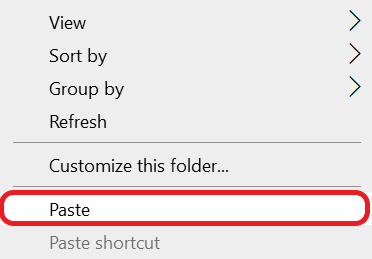
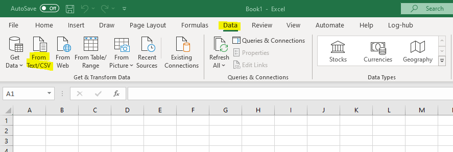

# User Guide

## Introduction

rainyDay is a desktop application for managing your finances that runs on a Command Line Interface (CLI). rainyDay
provides a simple solution to track your finances and achieve your financial goals.

This user guide provides an in-depth documentation on how to install rainyDay, how to use it, and the necessary
troubleshooting
steps you should take when encountering an issue.

## Acknowledgement

Thank you for using rainyDay. {todo}

<!-- TOC -->

* [Quick Start](#quick-start)
* [How to use the user guide](#how-to-use-the-user-guide)
* [Features](#features)
    * [Adding a transaction](#adding-a-transaction)
    * [Deleting a transaction](#deleting-a-transaction)
    * [Viewing the financial report](#viewing-the-financial-report)
    * [Viewing help](#viewing-help)
    * [Filter statements](#filter-statements)
    * [Edit statements](#edit-statements)
    * [Saving the data](#saving-the-data)
    * [Loading saved data](#loading-saved-data)
    * [Exporting to CSV](#exporting-to-csv)
    * [Exiting the application](#exiting-the-application)
* [FAQ](#faq)
* [Command Summary](#command-summary)
* [Glossary](#glossary)

<!-- TOC -->

## How to use the user guide

{todo patterns that we will be using, what does it mean, e.g. "", ` `, CAPS... etc}

## Quick Start

1. Ensure that you have Java 11 or above installed your computer
    1. Click [here](https://www.java.com/en/download/help/version_manual.html) for steps on how to check your Java
       version
    2. Click
       [here](https://docs.oracle.com/en/java/javase/11/install/overview-jdk-installation.html#GUID-8677A77F-231A-40F7-98B9-1FD0B48C346A)
       for the guide on installing Java 11
2. Download the latest version of "rainyDay"
   from [here](https://github.com/AY2223S2-CS2113T-T09-1/tp/releases/download/v1.0/rainyDay.jar).
3. Move the "rainyDay.jar" file to the folder of your choice by doing the following steps:
    1. Locate the "rainyDay.jar" file in your "Downloads" folder
    2. Right-click the "rainyDay.jar" file and select cut from the table that appears
       
    3. Go to the folder of your choice
    4. Right-click in the file window and select paste as seen below
       
4. In order to run "rainyDay.jar" on the command line, we have to do the following:
    1. Open the folder containing "rainyDay.jar" and click on the address bar
       
    2. Type the words "cmd" in the folder path in the address bar
       
    3. Hit the "enter" key. Your Command Prompt should now be open in the folder containing "rainyDay.jar".
5. Type `java -jar rainyDay.jar` and press Enter on your keyboard to start the application

## Features

### Adding a transaction

Adds a new transaction to the financial report.

Format: `add -DIRECTION DESCRIPTION $AMOUNT -c CATEGORY -date DD/MM/YYYY`

* The `DIRECTION` to be `in` signifying an inflow type of transaction, or `out` signifying an outflow type of
  transaction
* The `TRANSACTION_NAME` can be any keyboard input.
* The `AMOUNT` needs to be a number.
* {todo}

Example of usage:

`add -in angpao $500`

`add -out school fees $1000`

### Deleting a transaction

Deletes a transaction in the financial report.

Format: `delete INDEX`

* The `INDEX` needs to be a number

Example of usage:

`delete 1`

`delete 2`

### Viewing the financial report

Lists all the transaction added, the total resultant amount after inflow - outflow, total inflow amount, and total
outflow amount

Format: `view`

### Viewing help

{todo}

### Filter statements

View a filtered list of statements in the financial report

Format : `filter DESCRIPTION` or `filter FLAG FIELD`

* Default filter without `FLAG` filters by description
* The `FLAG` must be one of the following:
    * `-d` to filter by description
    * `-c` to filter by category
    * `-in` to filter by inflows
    * `-out` to filter by outflows
    * `-date` to filter by date
* date must be in the form DD/MM/YYYY

Example of usage:

`filter school`

`filter -d school`

`filter -date 22/03/2023`

### Edit statements

Edit a statement already in financial report

Format : `edit INDEX ADDCOMMAND` or `edit INDEX FLAG NEWFIELD` or `edit INDEX FLAG`

* The `FLAG` must be one of the following:
    * `-d` to edit the description
    * `-c` to edit the category
    * `-v` to edit the value
    * `-in` to change direction to inflow
    * `-out` to change direction to outflow
    * {todo}
* No `NEWFIELD` required for changing direction

Example of usage:

`edit 1 -add -in -d Beef noodles -c Food $15`

`edit 2 -d school`

`edit 3 -in`

### Saving the data

{todo}

### Loading saved data

{todo}

### Exporting to CSV

Exports your financial statements into a comma-separated values file.

Format: `export`
> **Background:** A CSV file allows data to be saved in a format which can be viewed as a table.
>
>💡Saving your financial statements in a CSV file will allow you to view your statements in commonly use applications
> like *Microsoft Excel* and *Google Sheets*.

#### Where to locate exported CSV file?

The CSV file will be located in the `data` folder within the same folder as your `rainyDay.jar` file. This should have
been configured in step 3 of the [Quick Start section](#quick-start). The CSV file will be named `report`.

#### How to view the CSV file using Microsoft Excel?

1. Open your Microsoft Excel application and open a blank workbook.
2. Click on the *Data* tab found at the top and click on *From Text/CSV*.
3. Navigate to the CSV file as directed in
   the [where to locate exported CSV file section](#where-to-locate-exported-csv-file).
4. Double-click on the CSV file and click the *load* button.
5. With steps 1-4, your financial statements should be viewable in a nicely formatted table as shown below.

### Exiting the application

{todo}

## FAQ

**Q**: How do I transfer my data to another computer?

**A**: Copy the txt file named "rainyDay" that is in the same directory as rainyDay.jar to the new device and location
that
"rainyDay.jar" is going to be stored in

## Command Summary

| Action | Format   Example input                                                                                                                                                                 |
|--------|-------------------------------------------------------------------------------------------------------------------------------------------------------------------------------------------|
| Add    | `add -`(in/out) (description) `$`(value)    **Example:**   `add -out Ipad $120`   `add -in angpao $3000`                                                                      |
| Delete | `delete` (index)    **Example:**   `delete 1`   `delete 2`                                                                                                                    |
| View   | `view`                                                                                                                                                                                    |
| Help   | `help`                                                                                                                                                                                    |
| Filter | `filter DESCRIPTION` or `filter FLAG FIELD`    **Example:**   `filter school`   `filter -d school`  `filter -date 22/03/2023`                                              |
| Edit   | `edit INDEX ADDCOMMAND` or `edit INDEX FLAG NEWFIELD` or `edit INDEX FLAG`    **Example:**   `edit 1 -add -in -d Beef noodles -c Food $15`   `edit -d school`   `edit -in` |
| Exit   | `bye`                                                                                                                                                                                     |

## Glossary

Filter

- {to add definition of financial report in our scope of application}

Financial Statement

- {to add definition of financial report in our scope of application}

Financial Report

- {to add definition of financial report in our scope of application}

Inflow

- {to add definition of financial report in our scope of application}

Outflow

- {to add definition of financial report in our scope of application}
